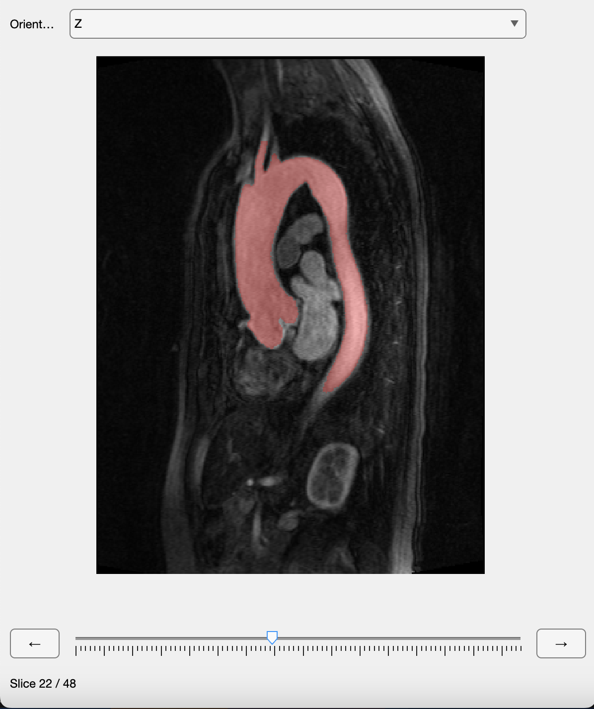

# MR Viewer

A lightweight MATLAB UI for visualizing 3D medical image volumes in mrStruct type.

## Features

* View arbitrary 3D volumes slice by slice in X, Y, or Z orientation
* Overlay an optional binary mask with opacity choice
* Navigate slices via:

  * Orientation dropdown menu
  * Left/Right buttons
  * Slider with live updating
  * Scroll wheel to iterate quickly through slices

## Requirements

* MATLAB R2020a or later
* Image Processing Toolbox (for `imshow` function)

## Installation

1. Clone or download the repository.
2. Add the project folder to your MATLAB path:

   ```matlab
   addpath(genpath('path/to/mr_viewer'))
   ```

## Usage

```matlab
% Load your mrStruct volumes into the workspace with the appropriately oriented dataAy volumes and vox.

img = load("CMRAMag.mat").mrStruct;

mrViewer(img);

% or with an optional mask overlay

img = load("CMRAMag.mat").mrStruct;
mask = load("CEMRA_aorta_grayvalues_mask_struct.mat").mrStruct;

mrViewer(img,mask)

```

### Controls

* **Orientation:** Select X, Y, or Z plane
* **← / → Buttons:** Move one slice left or right
* **Slider:** Jump to any slice
* **Slice Label:** Displays current slice index and total number of slices
* **Scroll:** Scroll over the figure to quickly switch between slices

* **Properties:**

  * `idx`: current slice index
  * `orientation`: current viewing plane ('X','Y','Z')
  * `imgVol`: 3D image array
  * `maskVol`: (optional) 3D binary mask array

### Visual Sample



## License

This project is licensed under the MIT License. See [LICENSE](LICENSE) for details.
